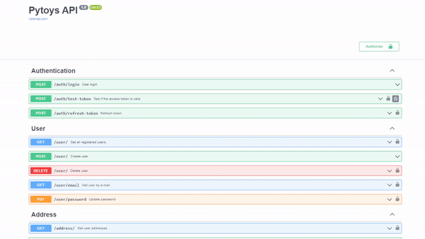
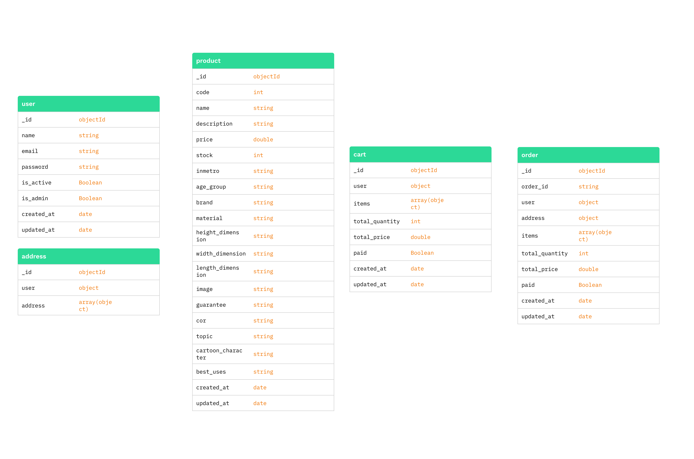

<div align=center>


	
# PyToys- Desafio final

</div>


<p align="center">
  
  
  
  
</p>


##  Objetivo do projeto

Este projeto tem como objetivo o desenvolvimento de uma **API RESTful** para a categoria *brinquedos* de um carrinho de compras. Para tanto, o projeto foi implementado em arquitetura **Model-View-Controller (MVC)** utilizando o framework web **FastAPI** e o banco de dados não-relacional **MongoDB**. 


##  Requisitos funcionais


:heavy_check_mark: **Gerenciamento de clientes:** Cadastro, busca,  atualização de senha e remoção;

:heavy_check_mark: **Gerenciamento de endereços:** Cadastro, busca e remoção;

:heavy_check_mark: **Gerenciamento de produtos:** Cadastro, busca, atualização, remoção;

:heavy_check_mark: **Gerenciamento de carrinho de compras:** Criação, inclusão/remoção de produtos e remoção do carrinho;

:heavy_check_mark: **Gerenciamento de pedidos:** Criação e busca.


##  Regras de negócio


- Cada usuário poderá ter somente um cadastro, validado por e-mail;
- Para atualização de senha o usuário precisa fornecer o e-mail e a senha atual em conjunto com a nova senha;
- Cada usuário poderá cadastrar quantos endereços quiser;
- Para atualização de produtos é necessário fornecer o seu código único e a informação que ele deseja atualizar;
- O carrinho de compras aberto foi interpretado como o carrinho em si e o carrinho de compras fechado seria o pedido de compra efetuado pelo usuário.
- Cada cliente poderá conter apenas **um** carrinho de compras, validado pelo e-mail;
- A quantidade de pedidos (carrinhos fechados) por cliente é ilimitada;
- Um carrinho de compras aberto não precisa necessariante possuir produtos;
- Na criação de um pedido (carrinho fechado), o parametro *paid* é alterado para *True* e o carrinho aberto é excluido;
- Após o fechamento de um pedido não será mais possível realizar alterações em suas informações.


##  Executando o projeto na sua máquina


Passo a passo para execução do projeto:

1) Criar um arquivo .env na raiz do projeto para configuração das variáveis de ambiente do banco de dados (para mais detalhes ver arquivo .env-example.txt).

2) Para executar a aplicação utilizando a nossa imagem Docker, execute o seguinte comando:
```
docker-compose up
```

##  Deploy e Documentação Swagger 
O deploy da aplicação foi realizado através do Heroku. A documentação de todas as rotas da API pode ser acessada através do seguinte link: https://pytoys-api.herokuapp.com/docs.



## Banco de dados



##  Testes
Os testes automatizados foram desenvolvidos através da utilização do framework **pytest**. Abaixo segue a cobertura total para todas as rotas da aplicação: 

```

---------- coverage: platform win32, python 3.10.7-final-0 -----------
Name                                                        Stmts   Miss  Cover
-------------------------------------------------------------------------------
main.py                                                        26      5    81%
shopping_cart\__init__.py                                       0      0   100%
shopping_cart\auth\__init__.py                                  0      0   100%
shopping_cart\auth\auth_handler.py                             12      0   100%
shopping_cart\controllers\__init__.py                           0      0   100%
shopping_cart\controllers\address.py                           50     18    64%
shopping_cart\controllers\cart.py                             107     75    30%
shopping_cart\controllers\exceptions\__init__.py                0      0   100%
shopping_cart\controllers\exceptions\custom_exceptions.py      19      7    63%
shopping_cart\controllers\order.py                             63     19    70%
shopping_cart\controllers\product.py                           47      7    85%
shopping_cart\controllers\user.py                              62     35    44%
shopping_cart\core\__init__.py                                  0      0   100%
shopping_cart\core\security.py                                 24     14    42%
shopping_cart\core\settings.py                                 21      0   100%
shopping_cart\cruds\__init__.py                                 0      0   100%
shopping_cart\cruds\address.py                                 35     21    40%
shopping_cart\cruds\cart.py                                    34     19    44%
shopping_cart\cruds\order.py                                   38     22    42%
shopping_cart\cruds\product.py                                 34     23    32%
shopping_cart\cruds\user.py                                    18      9    50%
shopping_cart\dependencies\__init__.py                          0      0   100%
shopping_cart\dependencies\user_deps.py                        23     11    52%
shopping_cart\routers\__init__.py                              10      0   100%
shopping_cart\routers\address.py                               19      3    84%
shopping_cart\routers\authentication.py                        31     14    55%
shopping_cart\routers\cart.py                                  20      3    85%
shopping_cart\routers\index.py                                  5      0   100%
shopping_cart\routers\order.py                                 29      5    83%
shopping_cart\routers\product.py                               29      2    93%
shopping_cart\routers\user.py                                  34      4    88%
shopping_cart\schemas\__init__.py                               0      0   100%
shopping_cart\schemas\address.py                               24      0   100%
shopping_cart\schemas\auth_schema.py                            7      0   100%
shopping_cart\schemas\cart.py                                  22      0   100%
shopping_cart\schemas\order.py                                 24      0   100%
shopping_cart\schemas\order_items.py                            7      0   100%
shopping_cart\schemas\product.py                               33      0   100%
shopping_cart\schemas\user.py                                  25      0   100%
shopping_cart\schemas\utils.py                                 12      0   100%
shopping_cart\server\__init__.py                                0      0   100%
shopping_cart\server\database.py                               25      9    64%
tests\__init__.py                                               0      0   100%
tests\test_conf.py                                              8      0   100%
tests\test_get_cart_by_email.py                                25      2    92%
tests\test_get_cart_by_email_fail.py                           25      3    88%
tests\test_remove_address.py                                   27      0   100%
tests\test_router_delete_all_cart.py                           25      0   100%
tests\test_router_delete_cart.py                               35      1    97%
tests\test_router_delete_product.py                            18      0   100%
tests\test_router_delete_product_fail.py                       18      0   100%
tests\test_router_get_address.py                               20      1    95%
tests\test_router_get_all_clients.py                           19      0   100%
tests\test_router_get_client_by_email_fail(.py                 19      0   100%
tests\test_router_get_client_by_email_ok.py                    18      4    78%
tests\test_router_get_order_by_email.py                        18      0   100%
tests\test_router_get_order_by_id.py                           19      0   100%
tests\test_router_get_order_count.py                           16      0   100%
tests\test_router_get_product_by_name.py                       11      0   100%
tests\test_router_get_product_by_name_without_name.py           9      0   100%
tests\test_router_get_products.py                              11      0   100%
tests\test_router_post_a_client.py                             21      1    95%
tests\test_router_post_a_client_fail.py                        21      1    95%
tests\test_router_post_address.py                              26      0   100%
tests\test_router_post_product_fail.py                         20      1    95%
tests\test_router_post_product_ok.py                           20      1    95%
tests\test_router_product_update.py                            14      0   100%
tests\test_routers_cart.py                                     30      1    97%
-------------------------------------------------------------------------------
TOTAL                                                        1500    345    77%
```

##  Tribo PyToys

  <p align="center">
<table>
  <tr>  
    <td align="center">
      <a href="https://github.com/HozaniaB">
        <br>
        <sub>
          <b>Hozania Barnabé</b>
        </sub>
      </a>
    </td>
    <td align="center">
      <a href="https://github.com/liviamrocha">
        <br>
        <sub>
          <b>Livia Rocha</b>
        </sub>
      </a>
    </td>
    <td align="center">
      <a href="https://github.com/palomasantos">
        <br>
        <sub>
          <b>Paloma Santos</b>
        </sub>
      </a>
    </td>
    <td align="center">
      <a href="https://github.com/PampSPP">
        <br>
        <sub>
          <b>Pâmela Czyziw</b>
        </sub>
      </a>
    </td>
  </tr>
</table>
<p>


## Links úteis:
<a href="https://docs.python.org/3/" target="_blank"></a> <a href="https://fastapi.tiangolo.com/" target="_blank"></a> <a href="https://www.mongodb.com/docs/" target="_blank"></a> <a href="https://swagger.io/docs/" target="_blank"></a>
